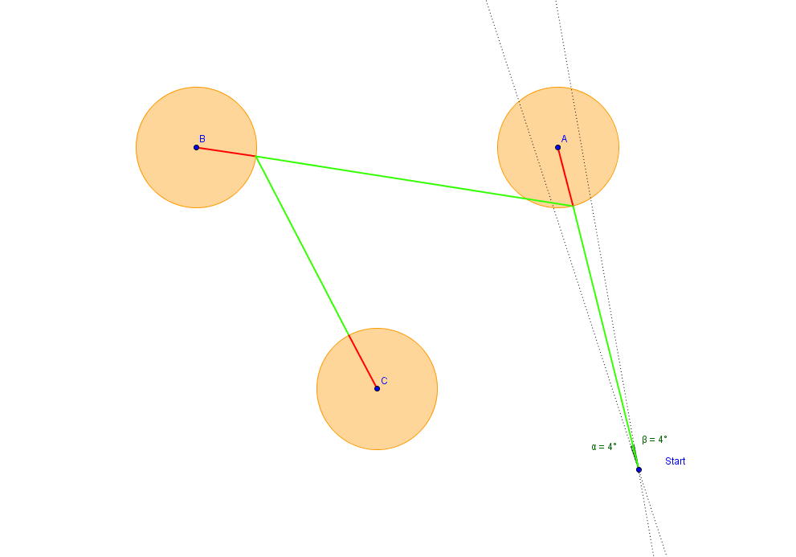
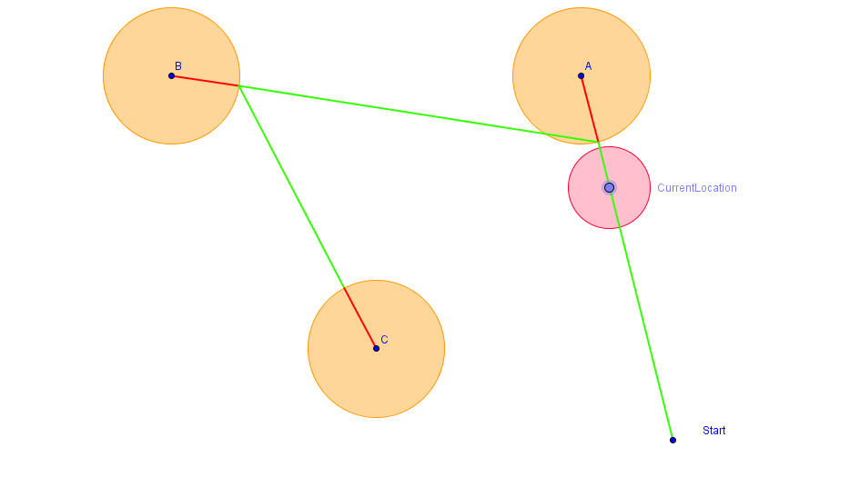
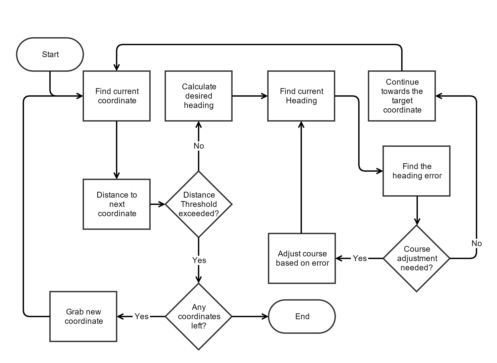

# GPSNav
This project was part of my groups semester project, with the theme "Microprocessor Based Systems". Together with a Mechanical Engineering group we (Electronics and Computer Engineering students) attempted to developed an autonomous bale collector.

We split the autonomous part into multiple smaller prototypes, the navigation between the bales and drop-off location was a single prototype.
## Components
* Adafruit Ultimate GPS Breakout Board
* HMC5883L Magnetometer
* DRV8833 Motorcontroller
* Arduino UNO

## Current Navigation Algorithm

The current program uses two arrays containing the target latitude and longitude. The program currently has no way of calculating the optimal drop-off location, and functions by showing the ability to move from point to point.


The heading of the vehicle is determined by the optimal heading, which is based on the current location of the vehicle and the target location.
```cpp
float calculateHeading(float currentLat, float currentLong, float targetLat, float targetLong){

  //Calculating the x and y arguments needed for the atan2 trig function
  //The heading is based on the target coordinates and the current coordinates
  float x = sin(radians(targetLong-currentLong)) * cos(radians(targetLat));
  float y = cos(radians(currentLat)) * sin(radians(targetLat)) - (sin(radians(currentLat)) * cos(radians(targetLat)) * cos(radians(targetLong-currentLong)));
  float heading = atan2(x, y);
  //If the heading is negative it can't be used, this can be corrected by adding two pi.
  if (heading < 0.0){
    heading += 2*PI;
  }

  return degrees(heading);
}
```

The calculated heading the is then compared with the heading read from the Magnetometer. To determine whether or not the vehicle should adjust towards the left or the right.



Since the accuracy of the GPS module is not completely spot-on, the program uses a threshold distance between its current location and the target location. If its within 3 meters of the target coordinate is will continue towards the next coordinate.
```cpp
float calculateDistance(float currentLat, float currentLong, float targetLat, float targetLong) {
    // Uses the haversine formula to calculate the distance between two points.
    // The distance is returned in meters
    float a = sq((sin((radians(currentLat - targetLat)) / 2.0))) +
              (cos(radians(currentLat))*cos(radians(targetLat)) * sq((sin((radians(currentLong - targetLong)) / 2.0))));
    float distance = 2.0 * 6371000 * asin (sqrt(a));
    return distance;
 }
```

The formula for calculating the distance between two coordinates and the heading calculation can be found at: http://www.movable-type.co.uk/scripts/latlong.html




#### Compass Calibration
To calibrate and obtain a heading value from the compass, the code written by @helscream was used. He wrote an excellent program that calibrates the Magnetometer (This being the compass.h file and compass.cpp)

https://github.com/helscream/HMC5883L_Header_Arduino_Auto_calibration

#### GPS Library
The library used for the GPS module is the Adafruit GPS library, which can be found at the link below.

https://github.com/adafruit/Adafruit_GPS
